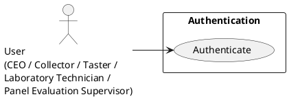
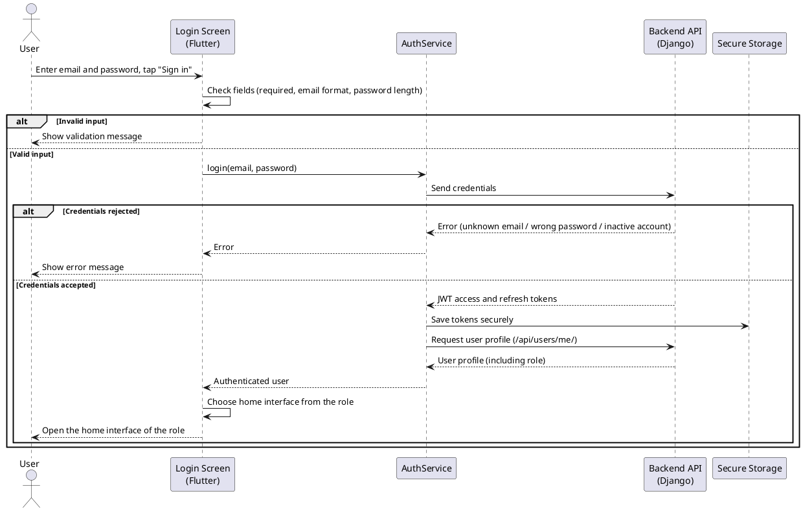

# Chapter 3 — Study and Realization of Sprint 1

## Introduction

After defining the different parts of the project, we begin the first sprint, structured around the following user stories:

- Authentication
- Administrator Sample Monitoring

## 1. Sprint 1 Backlog

This section presents the backlog of the first sprint, detailing the user stories and their associated tasks with the estimated duration.

**Table 3.1 — Sprint 1 Backlog**

| ID | User Story | Tasks | Duration (Days) |
|---|---|---|---|
| 1 | As a user, I can authenticate in order to access the interface and functionalities related to my role. | 1.1 Create the login screen with an email field and a password field. 1.2 Check the entered information inside the app before sending it (no empty fields, correct email format, password long enough). 1.3 Send the email and password to the server and verify if they are correct. 1.4 Keep the user connected by saving the connection safely on the device, then open the home screen that matches the user's role. | 4 |
| 4 | As an administrator, I can consult all collected samples grouped by collector in order to follow the samples brought during the day and monitor collection activity. | 4.1 Design the interface listing all collected samples grouped by collector. 4.2 Implement filtering by collector and by day. 4.3 Develop the backend to retrieve and group samples by collector. 4.4 Display the details of a selected sample. | 5 |

## 2. User Story 1: Authentication

To sign in, the user enters their email and password. The system verifies the credentials, issues JWT tokens, and redirects the user to the home interface corresponding to their role. On application startup, if a valid session token already exists, the user is redirected directly to their interface without re-authenticating.

### 2.1 Design

**"Authentication" Use Case Diagram**

In our application, every role uses the same single entry point: the login screen. Whatever the role (CEO, Collector, Taster, Laboratory Technician, Panel Evaluation Supervisor), the user performs the same action — authenticate — and the system then opens the interface that matches their role.

*Figure 3.1 — "Authentication" use case diagram*

The diagram is intentionally simple because authentication itself is one action shared by all roles. The difference between roles does not appear here; it appears right after, when the application chooses which home interface to open based on the role returned by the server.

**Textual Description of the "Authentication" Use Case**

**Table 3.2 — Textual description of the "Authentication" use case**

| Use Case | Authentication |
|---|---|
| Actors | CEO, Collector, Taster, Laboratory Technician, Panel Evaluation Supervisor |
| Description | This use case describes how a user signs in to the application by entering their email and password. The system verifies the credentials, identifies the user's role, and redirects the user to the corresponding home interface. |
| Pre-condition | The user has a valid and active account. |
| Main Scenario | 1. The user opens the application. 2. The system displays the login interface. 3. The user enters their email and password. 4. The user clicks the login button. 5. The system verifies the entered credentials. 6. The system identifies the user's role. 7. The user is redirected to the interface corresponding to their role. |
| Post-condition | The user is authenticated and redirected to the interface dedicated to their role, where they can access the functionalities assigned to them. |
| Exception Scenarios | 3. If the email field or the password field is empty, the system displays the message "Veuillez remplir tous les champs". Return to step 3. 5. If the email or password is incorrect, the system displays the message "Email ou mot de passe incorrect". Return to step 3. 5. If the account is inactive or unauthorized, the system displays the message "Compte inactif ou non autorisé". Return to step 3. |

**"Authentication" Sequence Diagram**

The following diagram shows what really happens in our application when a user signs in. It involves four parts: the login screen built with Flutter, our `AuthService` class that handles the authentication logic, the backend API built with Django, and the secure storage of the device.

*Figure 3.2 — "Authentication" sequence diagram*

A few technical points, explained simply:

- **JWT tokens:** when the email and password are correct, the backend returns two signed tokens (an access token and a refresh token). The access token is sent with every later request to prove the user is logged in, so the user does not have to type the password again on each screen. The refresh token is used to get a new access token when the old one expires.
- **Secure storage:** we save these tokens using `flutter_secure_storage`, which keeps them in the encrypted storage of the phone. This is safer than ordinary local storage because the tokens cannot be read easily by other applications.
- **Role-based redirection:** after login, the application asks the backend for the user profile (the `/api/users/me/` endpoint). The profile contains the role, and the application uses it to open the correct home interface (for example the CEO interface or the Collector interface).
- **Automatic session restore:** when the application starts again later, if a valid token is still stored, the user is taken directly to their interface without logging in again.

### 2.2 Realization

The authentication interface is a single screen, designed with the green color identity of the application. It contains two input fields, "Email" and "Password", and a button to sign in. The password field has a show/hide button so the user can check what they typed.

The screen also handles errors clearly:

- If a field is empty or the email format is wrong or the password is too short, a short message in red appears under the field, and the sign-in action is blocked.
- If the email and password do not match a valid account (unknown email, wrong password, or a deactivated account), a clear error message is shown above the form.
- If the server cannot be reached, a message asks the user to check their connection.

While the request is being processed, the button shows a loading indicator so the user knows the application is working.

*Figure 3.3 — Authentication interface (normal state)*

*Figure 3.4 — Authentication interface with a validation error*

> Note: the "Forgotten password?" link is present on the screen but the password-reset flow is not finalized yet; it is planned as a later improvement.

## 3. User Story 2: Consultation of Collected Olive Oil Samples

The administrator consults the olive oil samples registered in the system in order to have a clear overview of the collected samples and the samples added directly inside the company.

### 3.1 Design

**Textual Description of the "Consultation of Collected Olive Oil Samples" Use Case**

**Table 3.3 — Textual description of the "Consultation of Collected Olive Oil Samples" use case**

| Use Case | Consultation of Collected Olive Oil Samples |
|---|---|
| Actors | Administrator |
| Description | This use case allows the administrator to view the olive oil samples registered in the system. The samples are grouped by collector, while the samples added directly inside the company are displayed in a separate internal section. This gives the administrator a clear overview of the collected samples and the internally added samples. |
| Pre-condition | The administrator is authenticated and has access to the olive oil samples consultation page. |
| Main Scenario | 1. The administrator opens the olive oil samples consultation page. 2. The system displays the registered olive oil samples grouped by collector, as well as a separate internal section for samples added inside the company. 3. The administrator can search or filter the samples by date or by olive oil sample details, such as reference, supplier, governorate, variety and other available information. 4. The system updates the displayed list according to the search or selected filters. 5. The administrator selects an olive oil sample. 6. The system displays the details of the selected sample. |
| Post-condition | The administrator has consulted the registered olive oil samples and their details without modifying the data. |
| Exception Scenarios | 2. If no olive oil sample is available, the system displays the message "Aucun échantillon disponible". Return to step 2. 4. If no sample matches the search or selected filters, the system displays the message "Aucun résultat trouvé". Return to step 3. |
