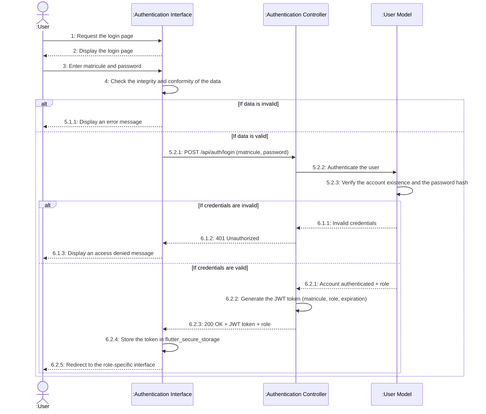

# Sequence Diagram — Authentication

> Sprint 1 — User Story 1: *As a User, I can authenticate with my matricule and password to access my role-specific interface.*

---

## 1. Textual description of the use case

| Use case | **Authentication** |
|---|---|
| **Actor** | User (Administrator, Collector, Panel Member, Laboratory Technician, Panel Evaluation Supervisor) |
| **Description** | This use case describes how a user logs into the application by entering their matricule and password. The backend verifies the credentials, generates a JWT token containing the matricule and role, and the application redirects the user to the interface dedicated to their role. |
| **Precondition** | The user owns a valid matricule and password, previously registered in the system by the Administrator. |
| **Post-condition** | The user is authenticated, their JWT token is securely stored on the device through `flutter_secure_storage`, and the user accesses the interface corresponding to their role. |
| **Nominal scenario** | 1. The user opens the application and reaches the login page.<br>2. The user enters their matricule and password, then clicks "Sign in".<br>3. The application checks the integrity and conformity of the entered data.<br>4. The application sends the credentials to the backend through a `POST /api/auth/login/` request.<br>5. The backend authenticates the user by checking the existence of the account and the match of the hashed password.<br>6. The backend generates a signed JWT token containing the matricule, role, and expiration date, and returns it in the `200 OK` response.<br>7. The application stores the token in `flutter_secure_storage`.<br>8. The application redirects the user to the interface corresponding to their role. |
| **Exception scenarios** | **3.** If the matricule does not contain exactly 4 digits or if the password is shorter than 4 characters, an error message is displayed: "The matricule must be composed of 4 digits" or "The password must contain at least 4 characters". Return to step 2.<br>**5.** If the matricule does not exist in the database or if the password does not match the stored hash, the backend returns `401 Unauthorized` and the application displays: "Invalid matricule or password". Return to step 2. |

---

## 2. Sequence diagram



---

## 3. Implementation notes (alignment with the project architecture)

| Lifeline | Technical component |
|---|---|
| `:User` | Human actor — an Al Jazeera STCA employee holding one of the five business roles. |
| `:Authentication Interface` | Flutter `LoginPage` in `lib/main.dart`. Uses `flutter_secure_storage` for token persistence (and **not** `SharedPreferences`, in line with the project conventions). |
| `:Authentication Controller` | Django REST Framework view exposed at `POST /api/auth/login/` (application `users`). Relies on the `djangorestframework-simplejwt` library to generate the token. |
| `:User Model` | Django `User` model (fields: `matricule`, `password` hashed with PBKDF2, `role`, `is_active`). Password verification uses Django's `check_password()`. |

### JWT token payload

```json
{
  "matricule": "1234",
  "role": "ceo",
  "exp": 1746897600
}
```

Signed with HS256 using the Django secret key. Lifetime configurable in `settings.py`. For all subsequent requests, the token is sent in the HTTP header `Authorization: Bearer <token>`, and each ViewSet checks the role through a custom `IsRoleX` permission.

### Final redirect

The Flutter application inspects the `role` field returned by the backend and uses `Navigator.pushReplacement()` to navigate to one of the five main interfaces (each role having its own `Drawer` and its own dashboard):

- `ceo` → `CeoHomePage`
- `collecteur` → `CollecteurHomePage`
- `degustateur` → `DegustateurHomePage`
- `technicien_laboratoire` → `LaboratoireHomePage`
- `chef_panel` → `ChefDegustateurHomePage`

---

## 4. Diagram conventions

- **4 standard lifelines**: Actor · Interface · Controller · Model — strict alignment with the project's MVC pattern (Flutter = views and interfaces, Django = controllers and models).
- **Solid arrow** = synchronous call. **Dashed arrow** = return or UI rendering.
- **Self-loop** on Interface (step 4) = client-side validation before any network call.
- **Self-loop** on Controller (step 6.2.2) = server-side JWT token generation.
- **Self-loop** on Interface (step 6.2.4) = secure local storage on the Flutter side.
- **Hierarchical numbering**: `5.1.x` / `5.2.x` for the first `alt` (client-side validation), `6.1.x` / `6.2.x` for the second nested `alt` (server-side verification).
