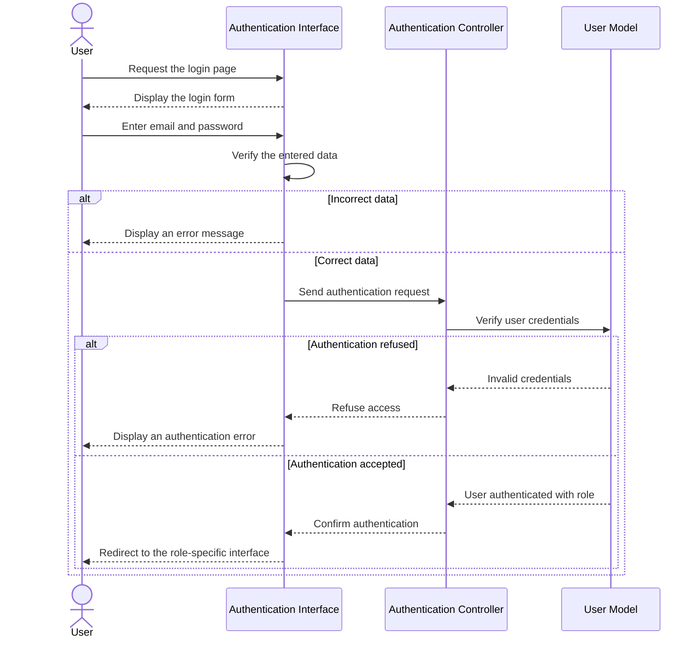

# Sequence Diagram - Authentication

This sequence diagram presents the main authentication steps. The user enters an email and password, the system verifies the information, then redirects the user to the interface that corresponds to their role if the authentication is accepted.

**Figure: Authentication sequence diagram.**

The authentication process starts when the user opens the login page and enters their email and password. The system checks the entered data, verifies the user credentials, and either displays an error message or opens the interface corresponding to the authenticated user role.
