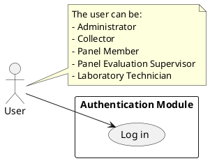
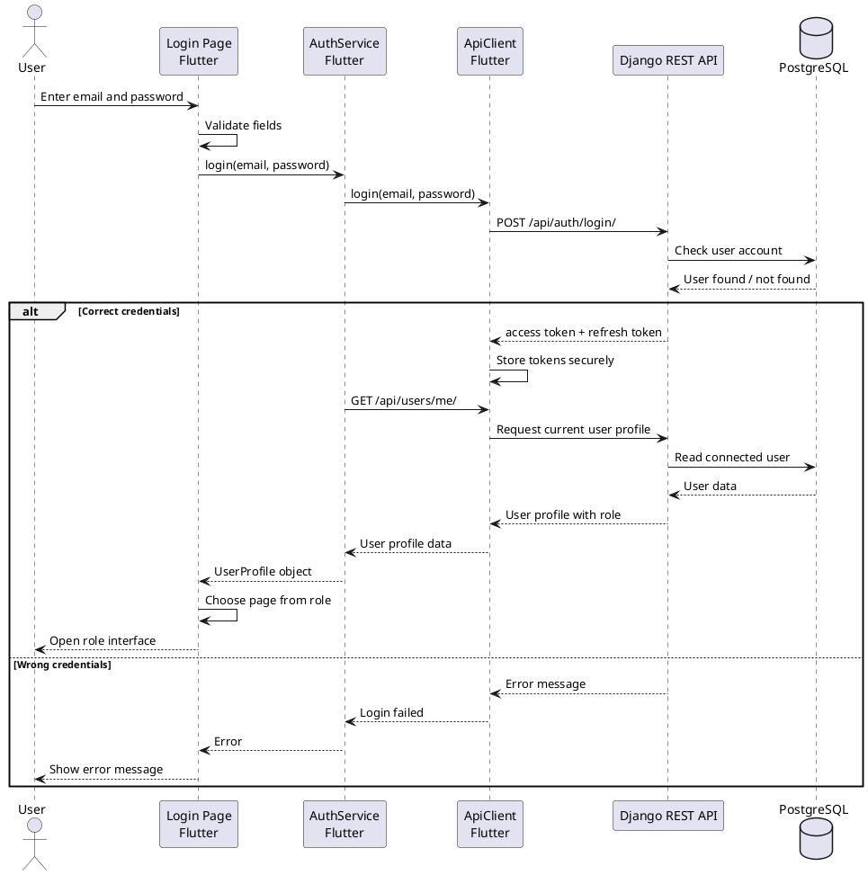

# Sprint 1 - Core Access and Sample Monitoring

## Introduction

This sprint starts the main application workflow. Before any user can access the application, the system must identify them and open the interface that matches their role.

Sprint 1 contains the following user stories:

- User Story 1: Authentication
- User Story 4: Administrator Sample Monitoring

The first user story to describe is **Authentication**, because it is the entry point of the whole system. Every role needs it before using the application.

## Sprint Backlog

| ID | User Story | Priority | Estimation |
|---|---|---:|---:|
| 1 | As a user, I can authenticate in order to access the interface and functionalities related to my role. | High | 4 Days |
| 4 | As an administrator, I can consult all collected samples grouped by collector in order to follow the samples brought during the day and monitor collection activity. | High | 5 Days |

## User Story 1 - Authentication

### 1. Conception

Authentication is the process that allows a user to enter the application using an email and a password.

In this project, all users start from the same login screen. After the backend checks the email and password, the application receives the connected user's role. This role is then used to open the correct interface.

For example:

- A collector is redirected to the collector interface.
- A laboratory technician is redirected to the laboratory interface.
- A panel member is redirected to the tasting interface.
- A panel evaluation supervisor is redirected to the chef de panel interface.
- An administrator is redirected to the administration interface.

The important idea is simple: **the login screen only identifies the user; the role decides which part of the application the user can access.**

### 1.1 Use Case Diagram

The authentication use case is shared by all roles. The user enters their credentials, and the system verifies them before giving access to the correct interface.

**Figure - Authentication use case diagram**

### 1.2 Textual Description of the Use Case

| Element | Description |
|---|---|
| Use Case | Authentication |
| Main Actor | User |
| Goal | Allow the user to access the application interface related to their role. |
| Preconditions | The user has an existing active account in the system. |
| Postconditions | The user is connected and redirected to the correct home page. |
| Main Scenario | 1. The user opens the application. 2. The login page is displayed. 3. The user enters an email and a password. 4. The application checks that the fields are valid. 5. The application sends the email and password to the backend. 6. The backend verifies the credentials. 7. The backend returns authentication tokens. 8. The application stores the tokens securely. 9. The application requests the current user profile. 10. The backend returns the user information including the role. 11. The application opens the correct interface according to the role. |
| Alternative Scenario | If the email or password is invalid, the system displays an error message and the user stays on the login page. |
| Exception Scenario | If the backend is unreachable, the application displays a connection error message. |

### 1.3 Sequence Diagram

The sequence diagram shows how the login request moves between Flutter and Django.

**Figure - Authentication sequence diagram**

### 1.4 Class Diagram

The class diagram for the whole sprint should be written after both Sprint 1 user stories are described. This is easier because the class diagram must include the important classes used by Authentication and Administrator Sample Monitoring together.

For User Story 1, the important classes are:

- `LoginPage`
- `AuthService`
- `ApiClient`
- `UserProfile`

### 2. Realization

The authentication feature was implemented in the Flutter application using a login screen connected to the backend through the service layer.

The screen contains:

- an email field;
- a password field;
- a button to submit the login request;
- validation messages when the user enters incorrect information;
- loading feedback while the request is being processed.

After a successful login, the application stores the received tokens securely and requests the connected user profile. The role contained in this profile is then used to redirect the user to the correct interface.

Screenshots to add:

| Figure | Screenshot |
|---|---|
| Figure - Login page | Add screenshot of the normal login screen. |
| Figure - Login validation | Add screenshot showing an invalid email or empty password. |
| Figure - Successful redirection | Add screenshot of one role home page after login. |

